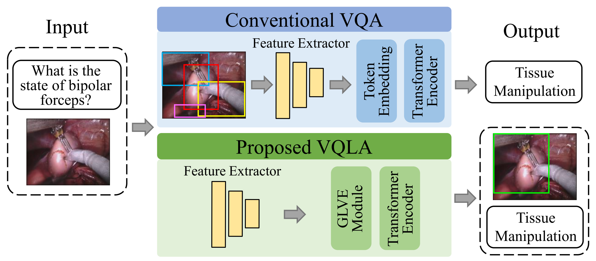

# Surgical-VQLA: Transformer with Gated Vision-Language Embedding for Visual Question Localized-Answering in Robotic Surgery

| [**arXiv**](https://arxiv.org/abs/2305.11692) | [**Paper**](https://ieeexplore.ieee.org/iel7/10160211/10160212/10160403.pdf) |
|:------------------------------------------:|:----------------------------------------------------:|

---

## Abstract

Despite the availability of computer-aided simulators and recorded videos of surgical procedures, junior residents still heavily rely on experts to answer their queries. However, expert surgeons are often overloaded with clinical and academic workloads, limiting their availability. To address this, we develop a surgical question-answering system to facilitate robot-assisted surgical scene and activity understanding from recorded videos. 

Most existing visual question answering (VQA) methods rely on object detectors and region-based feature extractors to combine visual and textual data for answer generation. However:
- Surgical object detection models are scarce due to smaller datasets and lack of bounding box annotations.
- Current fusion strategies for heterogeneous modalities like text and image are naive.
- Localized answering, crucial for complex surgical scenarios, is missing.

In this paper, we propose **Visual Question Localized-Answering in Robotic Surgery (Surgical-VQLA)** to localize specific surgical areas during answer prediction. To address these limitations, we:
1. Design a **Gated Vision-Language Embedding (GVLE)** to fuse heterogeneous modalities.
2. Propose the **Language Vision Transformer (LViT)** to jointly predict answers and localize bounding boxes.
3. Integrate **generalized intersection over union (GIoU) loss** to improve localization while preserving question-answering accuracy.

We annotate two datasets (EndoVis-17 and EndoVis-18) with VQLA tasks using publicly available surgical videos from the MICCAI challenges. Our validation results demonstrate that Surgical-VQLA effectively understands surgical scenes and localizes specific areas related to question-answering, achieving superior performance over existing benchmarks.

<p align="center">

</p>

---

## Environment Setup

Install the required libraries:

- PyTorch
- numpy
- pandas
- scipy
- scikit-learn
- timm
- transformers
- h5py

```bash
pip install torch numpy pandas scipy scikit-learn timm transformers h5py
```

---

## Directory Setup

In this project, we implement our method using the PyTorch library. The directory structure is as follows:

```
checkpoints/: Contains trained weights.
dataset/
    bertvocab/
        v2/: BERT tokenizer vocabulary.
    EndoVis-18-VQLA/
        seq_{1,2,...,16}/: Sequence folders containing:
            left_frames/: Image frames.
            vqla/
                label/: Q&A pairs and bounding box labels.
                img_features/: Extracted features (e.g., 5x5 patches by ResNet18).
    EndoVis-17-VQLA/: Selected frames for external validation.
        left_frames/
        vqla/
            label/: Q&A pairs and bounding box labels.
            img_features/: Extracted features using ResNet18 and Fast-RCNN.
feature_extraction/:
    feature_extraction_EndoVis18-VQLA-frcnn.py: Extract features using Fast-RCNN.
    feature_extraction_EndoVis18-VQLA-resnet.py: Extract features using ResNet18.
models/: Contains model implementations (e.g., GVLE, LViT).
dataloader.py
train.py
utils.py
```

---

## Dataset

1. **EndoVis-18-VQA**: Download frames and annotations directly from the [EndoVis Challenge Website](https://endovis18.org).
   - [VQLA Data](https://drive.google.com/file/d/1m7CSNY9PcUoCAUO_DoppDCi_l2L2RiFN/view?usp=sharing)

2. **EndoVis-17-VLQA**: External validation set.
   - [Images & VQLA Data](https://drive.google.com/file/d/1PQ-SDxwiNXs5nmV7PuBgBUlfaRRQaQAU/view?usp=sharing)

---

## Run Training

Train the model on EndoVis-18-VQLA:

```bash
python train.py --checkpoint_dir /CHECKPOINT_PATH/ --transformer_ver lvit --batch_size 64 --epochs 80
```

---

## Evaluation

Evaluate the model on EndoVis-18-VQLA and EndoVis-17-VQLA:

```bash
python train.py --validate True --checkpoint_dir /CHECKPOINT_PATH/ --transformer_ver lvit --batch_size 64
```

---
